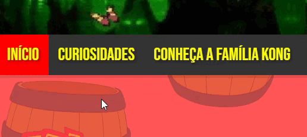
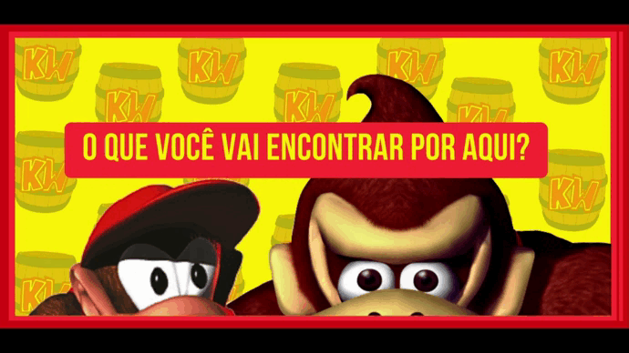

# 

>Seja bem-vindo ao projeto da Kong WIKI, o site consiste em uma fonte definitiva para descobrir o vasto universo do Donkey Kong! Se você é um entusiasta apaixonado dos jogos Donkey Kong ou está apenas começando a explorar a selva da Ilha Kong, você está no lugar certo. Meu projeto tem como missão principal proporcionar informações detalhadas, curiosidades cativantes e uma visão profunda sobre essa amada franquia de jogos.

### 🌐 Confira o site!

A base inical e funcional do projeto está pronta! Esse modelo porém não está responsivo, caso aconteça algum problema na visualização do site peço para que ajuste o zoom da pagina para que assim consiga ver o resultado esperado. Por ser meu primeiro projeto espero que entenda, mas agora chega de enrolações, de uma olhada no resultado:

[Kong WIKI || Tudo sobre um dos jogos mais clássicos de todos os tempos! ](https://kongwiki.netlify.app/)

## 💻 Conheçendo o HTML

Para iniciar vou listar algumas tags utilizadas para o funcionamento do meu site:

* **`<!DOCTYPE html:>`** Declara o tipo de documento como HTML.

* **`<html:>`** O elemento raiz que envolve todo o conteúdo HTML.

* **`<head:>`** A seção de cabeçalho que contém metadados, links para estilos e outros recursos.

* **`<link:>`** Usado para vincular recursos externos ao documento, como folhas de estilo CSS e ícones. No meu caso, estou vinculando uma fonte do Google e uma folha de estilo CSS.

* **`<"meta charset="UTF-8":>`** Define a codificação de caracteres para UTF-8, que é amplamente usada para suportar caracteres especiais.

* **`<title:>`** Define o título da página que é exibido na aba do navegador.

* **`<link rel="stylesheet" href="/style.css":>`** Vincula a folha de estilo externa chamada "style.css" ao documento.

* **`<link rel="shortcut icon" href="img/KW LOGO.png" type="image/x-icon">`** Define o ícone da aba do navegador, também conhecido como favicon.

* **`<body:>`** A seção principal do documento que contém o conteúdo visível da página.

* **`<div:>`** Um elemento de divisão que usei para agrupar e estilizar blocos de conteúdo.

* **`<a:>`** A tag de âncora usada para criar links para outras páginas e recursos externos.

* **``** Usado para incorporar imagens na página. O atributo src especifica a URL da imagem e o atributo alt fornece um texto alternativo para acessibilidade.

* **`<p:>`** Define um parágrafo de texto.

* **`<h2>:`** Cria um cabeçalho de segundo nível.

* **`<ul>:`** Cria uma lista não ordenada.

* **`<li>:`** Define um item de lista em uma lista não ordenada.

* **` :`** Insere uma quebra de linha.

* **`<carousel>:`** Um um elemento personalizado que foi usado para criar um carrossel de imagens.

* **`
 e 
:`** Essas classes CSS foram usadas para criar um layout de grade.

* **`iframe class="spotify"`** Utilizei para incorporar recursos do Spotify em meu site

* **`iframe class="youtube"`** Utilizei para incorporar recursos do YouTube em meu site

* **`</html:>`** Fecha o elemento raiz HTML.

## 🧩 Conhecendo o CSS

Agora para a aparência do projeto vou listar alguns seletores e recursos que utilizei: 

* Em tags tipo **`<p:>`** para parágrafos defini esses seletores:

Nesse exemplo utilizei o **`color:`** para definir a cor da fonte do meu texto, onde a mesma defini através do **`font-family:`**, para o tamanho utilizei o **`font-size:`** e também coloquei uma sombra nos textos para dar uma profundidade e estilo na vizualização através do **`text-shadow:`**.

Agora para alguns ajustes na exibição do texto no seletor **`.card `**, utilizei o **`content:`** para adicionar um conteúdo vazio antes do texto, **`display: inline-block`** para transformar em um elemento inline-block, **`width`** para a largura e **`margin-left:`** e **`margin-top:`** para ajustes de margens

>Utilizei a tag **`<p:>`** como um exemplo, porém essas mesmas configurações foram aplicadas em todos os textos no meu site, as unicas mudanças que variam são cores, tamanho e tipo da fonte, margens e alinhamento.

* Agora, no seletor **`.topo-com-fundo `** podemos ver algumas novas funções:

Com o **`background-image:`**. **`background-size:`** e **`background-position:`** posso definir o plano de fundo do meu site com uma imagem, ajustando seu posicionamento e mantendo assim uma padrão para a página.

>Na tag **`<body:>`** complementei com o **`background-repeat:`** para a imagem em questão ficar infinita, se repetindo sempre que necessário.

* No seletor **`.imagecuriosi1`**, utilizei algumas outras funções:

Aqui defini o **`max-height:`** para especificar uma altura limite para a imagem e adicionei também uma borda colorida com o **`border:`**

>Todos os seletores que possuirem um numero na frente como exemplo o **`.imagecuriosi1`**, quer dizer que possui mais de uma versão desse seletor, onde a diferença está apenas em configurações de margem, tamanho máximo e outros relacionados.

* Nos seletores, **`ul li a`**, **`ul li a:hover`** e **`ul li a.active`**:

Foi definido que quando o mouse passar pelo texto vai ativar uma transição suave, mudando a cor do texto, e quando o usuário clica em uma da abas da barra de navegação a aba em questão ficará na cor vermelha, onde seu funcionamento ocorre assim:

>Através desse projeto consegui perceber que os minímos detalhes, por mais que o usuário "não perceba" quando está utilizando o recurso fazem toda a diferença, pois na falta de certas funcionalidades pode acabar atrapalhando na experiência final do usuário.

* Para o carrosel de imagens no site utilzei esses recursos:

Essas funções foram usadas para criar um carrossel de slides que exibe as imagens em uma única linha horizontal, permitindo a transição suave entre elas usando animações. Cada slide ocupa quase toda a largura do contêiner do carrossel, e as imagens dentro dos slides são dimensionadas para se ajustarem corretamente. Seu funcionamento ficou assim:

>A velocidade representada aqui não é a mesma no site, acelerei para ficar mais fácil de observar o funcionamento do carrosel de imagens.

* No meu site também incorporei recursos do Spotify e YouTube:

Onde aqui no CSS, deixei definido especificações como o tamanho, margens, bordas e sombreamento.
Suas representações ficaram assim:

* Spotify:
  
 

* YouTube:

## ☕ Observações 

 >Aqui nas explicações não mencionei alguns seletores pois eles possuem os mesmos recursos que mencionei acima, então ficaria repetitivo. Com esses exemplos que demonstrei é possivel ver todas as funções que utilizei em todos os seletores em meu site, onde reuni apenas os mais interessantes e também aqueles que continham maior numero de recursos dentro de um seletor, para ficar melhor a exemplificação.

## 🐵 Considerações Finais

 Se você chegou até aqui e conseguiu aprender um pouco sobre o funcionamento do meu site fico muito grato! Como meu primeiro projeto espero poder melhorar muito ainda meus conhecimentos e assim entregar algo mais elaborado e melhor documentado (desculpe caso encontre algum erro de ortografia ou se utilizei alguma definição errada rs), agradeço aqui também ao meu professor da faculdade que está sempre dando o apoio necessário e caminhos para meu aperfeiçoamento. 

> Que este projeto possa servir de inspiração para outras pessoas que estão iniciando no mundo **`<dev>`**, assim como eu. Quero que todos percebam que somos capazes de realizar projetos, independentemente de quão simples possam parecer, pois eles desempenham um papel significativo em nosso desenvolvimento profissional e criativo. Agradeço a atenção de todos e até a próxima! 🚀

